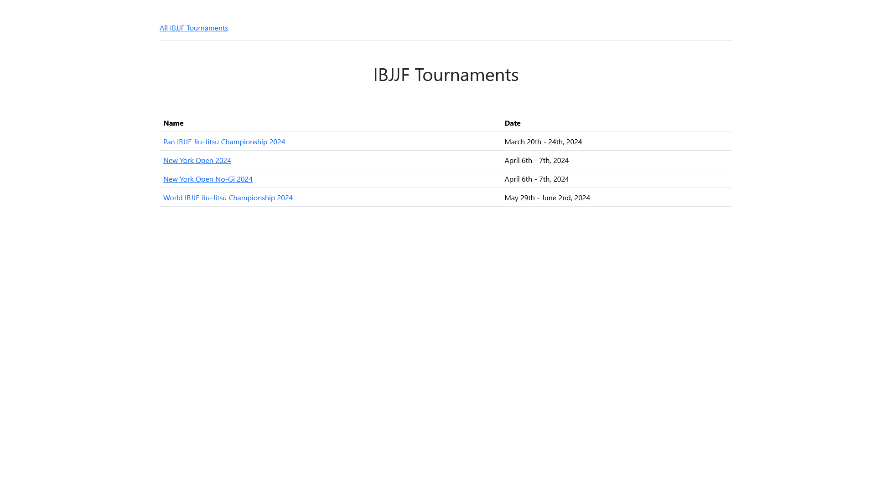
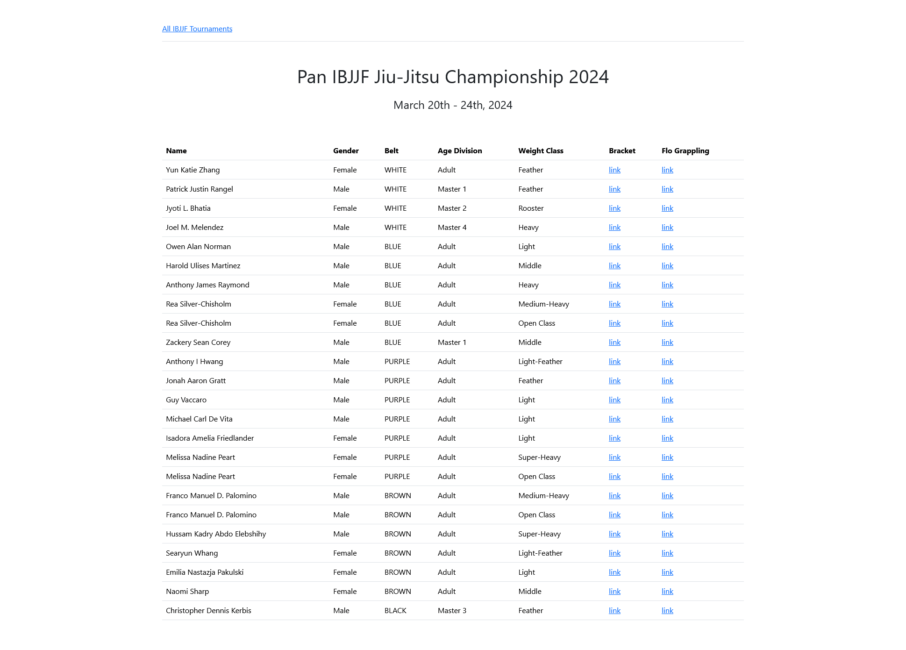

# IBJJF Tournament Browser

This is an app that lets you easily browse IBJJF tournaments for Unity athletes.  I hope it helps you find your friends and support them as they compete!

Contributions are welcome.  Current wishlist is:

  - generate event data by crawling the IBJJF calendar
  - browse other teams or ad-hoc sets of athletes (e.g. your favorites)

## Installation

This is a Python app which uses Selenium.  To setup

- install Python 3
- download [ChromeDriver](https://chromedriver.storage.googleapis.com/index.html?path=114.0.5735.90/) and add it to your PATH variable

## Running

- `python -m venv ibjjf`
- activate virtual environment:
  - Mac/Linux: `source env/bin/activate`
  - Windows: `.\env\Scripts\activate`
- `pip install -r requirements.txt`
- `python fetch-athletes.py` (will launch browser the 1st time: takes ~2 minutes)

## Use

Keep the python program running, then type `localhost:8080` in Chrome.  You should see:

If you click on a tournament, you should see:

